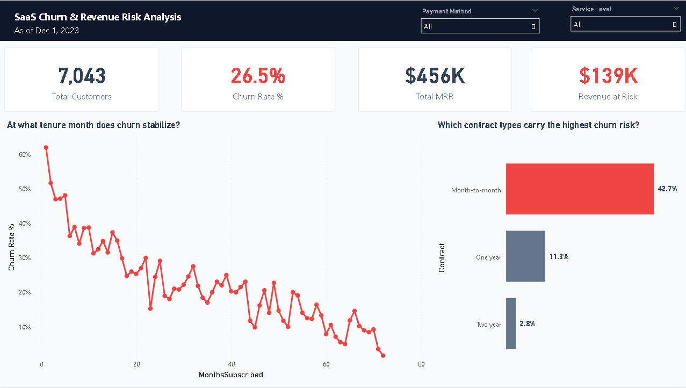
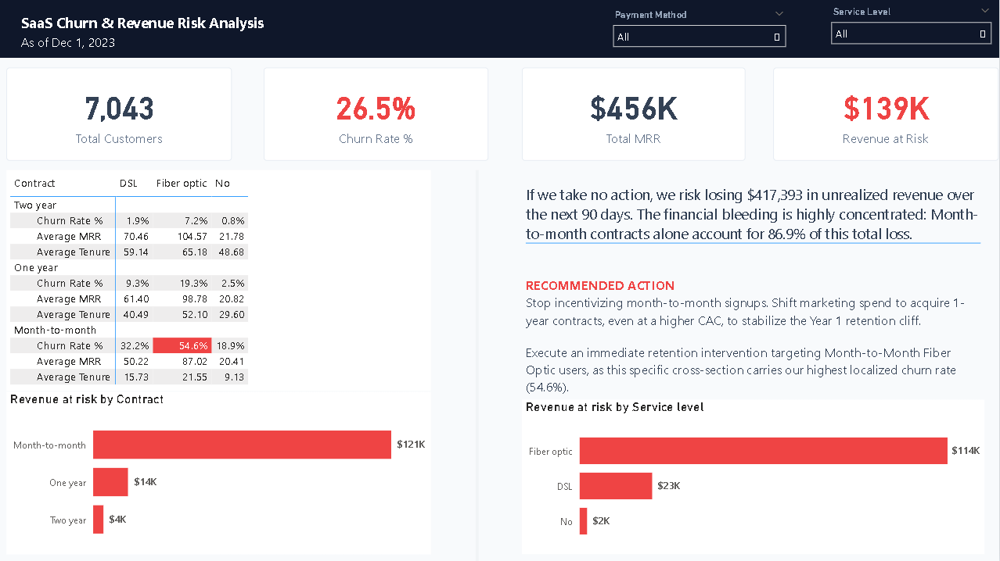

# SaaS Customer Churn & Revenue Risk Analysis

## Business Problem
A telecommunications SaaS provider is experiencing a 26.5% churn rate, bleeding $139,000 in active Monthly Recurring Revenue (MRR). This project isolates the high-risk operational segments driving the cancellations and models the 90-day financial penalty to establish precise targets for retention campaigns.

## Key Findings
1. **The 90-Day Financial Penalty:** At current churn velocity, the business risks over $417,000 in unrealized revenue over the next 90 days if no intervention occurs.
2. **The Month-to-Month Trap:** The financial bleeding is highly concentrated. Month-to-month contracts carry a 42.7% churn rate and account for 86.9% of the total revenue loss, meaning the company is acquiring users who mathematically leave before hitting LTV profitability.
3. **The Year 1 Cliff:** 47% of all churned customers cancel before their 12th month. The direct consequence is that standard annual retention efforts are launching too late, entirely missing the critical drop-off window.

## Business Recommendations
1. Cease month-to-month marketing incentives immediately and absorb a higher Customer Acquisition Cost (CAC) to lock users into 1-year contracts.
2. Deploy a strict 90-day and 180-day customer success intervention pipeline for Fiber Optic users to force product adoption before the 12-month drop-off cliff.

## Tech Stack
- **Python:** Pandas, NumPy (Data cleaning, type coercion, EDA)
- **SQL:** MySQL, CTEs, Window Functions (Cohort aggregation, localized retention modeling)
- **Business Intelligence:** Power BI, DAX, Star Schema (Executive dashboarding and risk projection)

## Executive Dashboards

## Assumptions & Limitations
- **Lack of Time-Series Precision:** The dataset provides a static cross-sectional snapshot with no exact signup or churn event timestamps. This prevents cohort tracking based on specific market events.
- **Missing Acquisition Metrics:** Marketing spend, customer acquisition cost (CAC), and campaign attribution data are absent, preventing exact LTV:CAC profitability modeling.
- **Length Bias in Churn Calculation:** Longer-tenured customers are over-represented in the retained group, while newer customers have had less exposure time to churn, potentially understating true churn risk for recent sign-ups.
- **Blended MRR:** The overall average MRR blends active and churned customers, which overstates current revenue health. Including a churned customer's historical MRR inflates the active baseline.
- **Static Cohorts:** Tenure cohorts were explicitly binned into standard 12-month B2B SaaS annual contract cycles, ignoring the calendar year of acquisition.